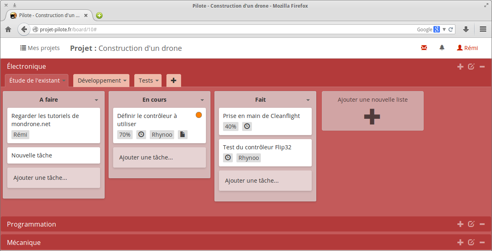

# Pilote

## Outils de gestion collaborative de projets

Pilote est une application web Open Source développée en **PHP** (_Symfony2_) et en **Javascript** (_jQuery_ et _Node.Js_) permettant de faciliter la gestion d'un grand nombre de projets de groupes et d'utilisateurs.

----

## Présentation

#### Création de projets

Les utilisateurs ont la possibilité de créer des projets et d'inviter d'autres utilisateurs à le rejoindre.

<!-- index-1 --> 

    

#### Affichage des tâches en listes (méthode Kanban)

Dans chaque projet, une interface simple permet de créer des tâches et des listes de tâches, et de les regrouper dans des étapes et dans des domaines plus généraux. Un simple glisser-déposer suffit à les réorganiser. Pour ce projet de conception de drônes par exemple, le domaine _Mécanique_ contiendra les étapes _Conception_, _Assemblages_ et _Tests de fiabilité_ alors que le domaine _Informatique_ aura plutôt les étapes _Étude de l'existant_, _Développement_ et _Tests_. Ainsi les différents corps de métier qui composent un projet complexe sont regroupés au sein du même outil.

<!-- index-2 --> 

    

Pour chaque tâche, il est possible de définir plusieurs paramètres optionnels :
- Définir des dates de début et de fin
- Poster des commentaires
- Assigner une tâche à un membre du projet
- Définir un label (_Important_, _Peu important_, _En retard_, etc)
- Lier une pièce jointe
- Définir un pourcentage de progression
- Ajouter des listes de cases à cocher

<!-- index-3 --> 

    

#### Diagrammes de Gantt et calendrier

Afin d'afficher de manière plus visuelle d'évolution du projet, Pilote offre la possibilité d'afficher les tâches sous la forme de diagrammes de Gantt et de calendriers relativement flexibles avec des options de filtrages.

<!-- index-4 --> 

    

De plus, il est aussi possible pour l'utilisateur courant d'afficher un diagramme de Gantt pour toutes les tâches qui lui sont assignées sur tous les projets auxquels il est rattaché.

#### Messagerie

Pilote propose un système de messagerie instantanée : Une discussion de groupe est automatiquement créée pour chaque projet, mais il est possible de créer des conversations privées avec les autres utilisateurs de Pilote.

<!-- user-16 --> 

    

#### Zone d'administration

L'administrateur de Pilote a accès à une zone d'administration pour afficher et gérer l'ensemble des utilisateurs et des projets, créer un nouvel utilisateur ou vérifier différents paramètres de configuration.

Pilote étant basé sur le framework PHP Symfony2, il s'installera très facilement sur n'importe quel serveur Linux (mais peut aussi tourner sur OS X ou Windows) grâce à _Composer_.

<!-- index-5 --> 

    

#### Connexion à un annuaire LDAP

Il existe deux branches disponibles de Pilote, une classique nécessitant l'inscription des utilisateurs, et une permettant d'utiliser les comptes définis sur un serveur LDAP distant.

Il est possible de faire cohabiter les utilisateurs connectés via l'annuaire LDAP et ceux inscrits directement sur le site. L'administrateur peut aussi bloquer les inscriptions en changeant simplement un paramètre, et aussi rajouter des utilisateurs depuis la zone d'administration.

Plus de détails et de captures d'écran [ici](doc/utilisateur.md).

----

## Aide aux utilisateurs

Voir la [page concernée](doc/utilisateur.md).

## Documentation technique

#### Installation 

Voir le [tutoriel d'installation](doc/installation.md).

#### Vous souhaitez contribuer ou _forker_ le projet ?

Voir la [page concernée](doc/contribution.md).