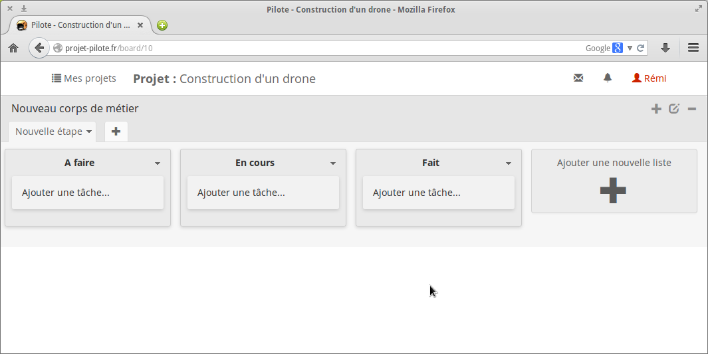

# Aide à l'utilisateur

Pour commencer, sachez qu'aucune page n'est accessible aux utilisateurs non connectés. Commencez donc par vous inscrire ou vous connecter.

<!-- user-1 --> 
<!--<p align="center">
    
</p>-->

----

## Création d'un projet

Sur la page d'accueil, créez un nouveau projet. Saisissez un nom et une rapide description. Une fois créé, cliquez dessus pour y accéder.

Vous arrivez sur cette page :

<!-- user-2 --> 
<p align="center">
    
</p>

Vous pouvez voir que trois __listes de tâches__ sont créées par défaut, à savoir _A faire_, _En cours_ et _Fait_. Vous pouvez en ajouter en cliquant sur le bouton à droite. Cliquez sur la petite flèche à droite de leur nom pour les renommer ou les supprimer.

Ces listes sont regroupées dans un __onglet__ _Nouvelle étape_. Vous pouvez ajouter des onglets avec le bouton ```+``` à côté, et ajouter de nouvelles listes à l'intérieur de ce nouvel onglet. Cliquez sur la petite flèche à droite de leur nom pour les renommer ou les supprimer.

Ces onglets sont eux-mêmes regroupés dans un __corps de métier__. Vous pouvez les renommer, les supprimer ou en ajouter de nouveau grâce aux boutons situés à droite du titre.

> __Astuce__ : Si vous n'utilisez qu'un seul corps de métier, nous pouvez gagner de l'espace à l'écran en cliquant sur le bouton de renommage du corps de métier et en supprimant tout le texte.

Les tâches sont __réagençables__, vous pouvez les glisser-déposer au sein d'une liste, ou bien d'une liste à un autre. De même, les listes sont déplaçables au sein d'un onglet.

<!-- user-3 --> 
<p align="center">
    
</p>

----

## Éditer une tâche

En cliquant sur une tâche, la fenêtre de détail et d'édition de la tâche s'ouvre. Cliquez sur la zone centrale pour éditer la description détaillée, comme sur la capture d'écran suivante :

<!-- user-4 et user-5 --> 
<p align="center">
    
    
</p>

Vous pouvez ajouter plusieurs éléments à une tâche :
- Des __commentaires__
- Un label de __priorité__ : _Haute priorité_, _Priorité basse_, _En retard_, _Fait_, etc
- __Associer une personne__ à cette tâche : Ainsi dans le diagramme de Gantt, il est possible de filtrer les tâches par personne. De plus, l'utilisateur retrouve ses propres tâches, regroupées par projets, sur sa page de profil.
- Des __listes de cases à cocher__ : vous pouvez en ajouter plusieurs pour chaque tâche
- Des __dates de début et de fin__ : Si seule la date de fin est renseignée, la tâche apparaitra sous forme de jalon dans le diagramme de Gantt. Vous ne pouvez pas renseigner seulement la date de début.
- Une __progression__ : en pourcentage
- Une __pièce jointe__ : si le fichier est une image, un aperçu apparaitra au dessus du bouton.

Exemple de tâche :

<!-- user-6 --> 
<p align="center">
    
</p>

----

## Administrer un projet

L'accès aux différentes pages du projet s'obtient en cliquant sur le titre du projet, dans la barre de menu :

<!-- user-7 --> 
<p align="center">
    
</p>

Sur la page de configuration d'un projet, vous pouvez le renommer, choisir un thème de couleur, mais surtout ajouter ou supprimer des membres. Saisissez les premières lettres du pseudonymes et cliquez sur ```Ajouter```.

<!-- user-8 --> 
<p align="center">
    
</p>

> __Astuce__ : Mettre un peu de couleur dans les projets permet de mieux se retrouver sur la page d'accueil et dans le menu des projets.

<!-- user-9 --> 
<p align="center">
    
</p>
----

## Diagramme de Gantt & Calendrier

Via le menu du projet, vous avez accès au diagramme de Gantt et au calendrier. Les tâches possédant des dates de début et de fin y sont représentées.

### Diagramme de Gantt

Il est possible de double-cliquer sur une tâche pour faire apparaitre la fenêtre de détail et d'édition. Vous pouvez aussi déplacer les tâches pour changer leurs dates de début et de fin, ou encore définir des __contraintes de précédences__ en reliant avec la souris les extrémités de deux tâches.

Trois filtres sont disponibles pour modifier l'affichage du Gantt :
- Afficher les tâches de tous les membres du projet, ou seules celles assignées à un membre
- Afficher seulement les tâches en cours, ainsi que les jalons à venir
- Modifier l'échelle de temps

<!-- user-10 --> 
<p align="center">
    
</p>

### Calendrier

Ici encore, vous pouvez déplacer, redimmensionner ou afficher la fenêtre de détail d'une tâche. Les jalons sont affichés en bleu foncé et les autres tâches en bleu clair.

<!-- user-11 --> 
<p align="center">
    
</p>

## Diagramme de Gantt personnel

Dans le menu Utilisateur, vous pouvez trouver un diagramme de Gantt regroupant les tâches qui vous sont associées dans tous les projets auxquels vous participez :

<!-- user-12 --> 
<p align="center">
    
</p>
----

## Messagerie

Le menu Messagerie contient :
- Un lien vers la liste des conversations non lues
- Les conversations de groupe pour chaque projet
- Les conversations privées
- Un bouton pour marquer toutes les conversations comme lues

Pour chaque projet, une discussion est automatiquement créée, regroupant tous ses membres.

<!-- user-13 --> 
<p align="center">
    
</p>

La page d'accueil de la messagerie affiche les conversations non lues. Sur la droite, on retrouve les discussions pour chaque projet, les discussions privées et la possibilité de contacter les administrateurs :

<!-- user-15 --> 
<p align="center">
    
</p>

Exemple de conversation de groupe :

<!-- user-16 --> 
<p align="center">
    
</p>

----

## Notifications

Vous recevrez parfois des notifications si l'on vous ajoute à un projet, assigne à une tâche, ou si l'on modifie une tâche à laquelle vous êtes associé.

<!-- user-14 --> 
<p align="center">
    
</p>

----

## Profil utilisateur

La page de profil permet de modifier son pseudonyme, son adresse e-mail et son avatar. On y trouve aussi la liste de nos projets ainsi que les tâches qui nous sont associées.

<!-- user-17 --> 
<p align="center">
    
</p>
